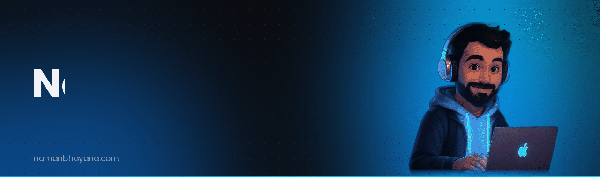
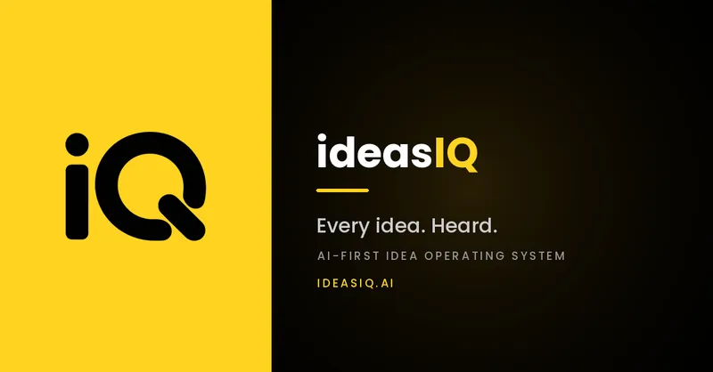
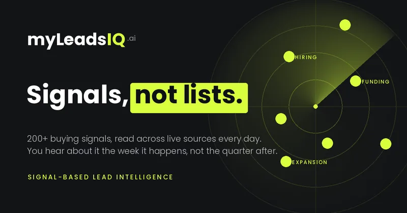

---

### I take products from idea to launch — and own every layer in between.

The agent runtime. The multi-tenant SaaS around it. The data and finance logic underneath. The go-to-market that gets it found, sold and used. I've been shipping that full stack for founders and enterprises since 2023, and today I lead AI engineering for an enterprise AI platform while building my own studio.

| | Layer | What I own |
|:-:|---|---|
| 🧠 | **AI systems** | Agent runtimes, multi-agent research pipelines, RAG, model governance, voice agents, fine-tuned SLMs |
| 🏗️ | **Product** | Multi-tenant SaaS, billing and subscriptions, dashboards, API-first platforms |
| 📈 | **Data & finance** | Market-data pipelines, trading strategies, analytics and decision tools |
| 🚀 | **Growth** | SEO & AEO, paid acquisition, autonomous outbound, analytics — the layer that turns a launch into revenue |

---

## ⚡ Building now

  
  

### ideasIQ — enterprise AI innovation platform &nbsp;·&nbsp; *Head of AI Engineering*
Own the AI architecture behind a platform that takes an organisation's ideas from raw submission to scored, strategy-ready deliverables.
- **Agent runtime** built in-house — retries, caching, cancellation, concurrency control — running a **14-stage research agent** that maps a market, challenges its own findings and ranks what's worth pursuing.
- **Model governance across a 400+ model gateway** — tiered access, per-call cost provenance and per-organisation spend ceilings.
- **Semantic graph backbone** — embeddings and knowledge graphs powering similarity, matching and recommendations across ideas.
- **AI deliverables engine** turning scored ideas into decks, video and live websites across five generation providers.
- **Knowledge Assistant** answering over a company's own documents, and a **tool-calling voice agent** that qualifies visitors and books meetings.
- **Autonomous outbound engine** plus the SDR team that runs it.
- **Next release:** fine-tuned small language models for cost-sensitive pipeline stages.

[ideasiq.ai ↗](https://ideasiq.ai)

### myLeadsIQ — lead-intelligence SaaS &nbsp;·&nbsp; *private beta*
Autonomous lead discovery across **11 live signal sources** with two-stage model routing, a reviewer-trained calibration loop, test-enforced tenant isolation, and evidence guards that downgrade any claim the model can't cite.

### Nexerah — AI product studio &nbsp;·&nbsp; *Founder, launching 2026*
A premium studio that builds and grows AI products for businesses — automations, software and trading systems, plus the search, paid, social and outbound growth that gets them used. One team, from scope to shipped to sold.

---

## 🛠️ Selected work

| Project | Domain | What shipped |
|---|---|---|
| **[InvestBeans](https://investbeans.com)** | Fintech | Led engineering on a subscription market-analytics SaaS — market-data pipelines, the indicators behind its decision tools, dashboards and billing. |
| **DocPad** | Healthcare | Cloud hospital-records platform — EMR, SNOMED CT clinical terminology, OCR on medical documents, API-first data exchange across hospitals and labs. |
| **Artize Dental** | Healthcare | Web platform for a dental clinic brand, built end to end. |
| **Prozone** | Hardware · Automotive | Windows desktop app that reads emissions-testing equipment over serial and serves live gas and smoke readings through a local API. |
| **SigmaBites · Sterling Naturals · New Gramophone House** | E-commerce | Order and inventory automation, backend workflows and storefront builds — cutting manual operations by 30–40%. |
| **Algorithmic trading** · Allianz Exports | Quant | Strategies on proprietary technical indicators in Python and Pine Script, tuned through backtesting. |
| **Recruitment platform** · Techlive Solutions | HR-tech | Full-stack hiring platform with real-time messaging and smarter job matching. |
| **[AlphaGPT](https://github.com/naman-bhayana/AlphaGPT)** | AI | Conversational assistant with persistent multi-thread memory and streaming responses. |

> Most of my production work lives in private repositories. Happy to walk through the architecture on a call.

---

## 🧰 Stack

    
  

**AI:** LLMs · agentic & multi-agent systems · RAG · vector search · LangChain · MCP · fine-tuning · voice AI · computer vision 
**Growth:** SEO & AEO · paid acquisition · outbound automation · analytics & attribution

---

**Building something ambitious? I take on a small number of engagements each quarter.**

[namanbhayana.com](https://www.namanbhayana.com) &nbsp;·&nbsp; [naman.bhayana13@gmail.com](mailto:naman.bhayana13@gmail.com)

